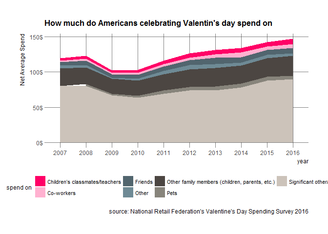
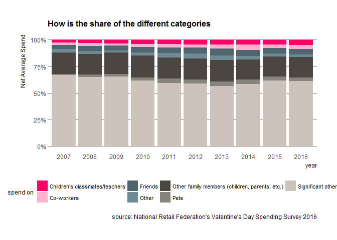

MakeoverMonday Week 7
================

Week 07 \#MakeoverMonday
------------------------

Week 07 topic is Valentin's Day and the makeover for the following \#viz <http://http://www.karbelmultimedia.com/2015/02/valentines-day-spending-infographic/> The for the makeover can be found as usually under <http://www.makeovermonday.co.uk/data/>

Makeover
--------

I will use the following libraries:

``` r
library(openxlsx) #load data
library(tidyr) # for data manipulation
library(dplyr) # for data manipulation
library(ggplot2) # ploting
library(hrbrthemes) # themes
library(scales) # scales for ggplot
```

Geting started
--------------

fist download the data from <http://www.makeovermonday.co.uk/data/> as Excel and read the data from your local directory. After that we need to bring them a proper form. In step one we convert the years into a column and in step two separate the the metrics that are in one column into two.

``` r
# load data
mom07_df_ori <- read.xlsx("Valentines Day Spending.xlsx", sheet = 1)

# prepare data 

mom07_df <- mom07_df_ori %>% 
  rename(spend_on = `How.much.money`)  %>%  #rename column
  gather(key="year", value="value", -Category, -spend_on, -Metric) %>%  # reshape data part one
  spread(Metric, value) # reshape data part2
```

Including Plots
---------------

Next step is already creating the plot. We will plot only the data of category "People". We will create 2 plots one with total spend per year per spend category as an area plot. And a bar chart that show share per category per year.

``` r
# we define a custom color palette
color_palette <- c("#ff0066", "#ffb1d0", "#51656e", "#6e8a95",  "#4c4642", "#87847b", "#ccc3ba", "#75b8d1", "#2d543d")

# bild base plot
g <- mom07_df %>% filter(Category == "People") %>% # filter data
  ggplot(aes(x=year, y=`Net Average Spend`, fill=spend_on, group=spend_on)) + # base plot
  scale_fill_manual(name="spend on", values=color_palette) # add custom colors and name

# create area plot with total spend
g1 <- g + geom_area() + 
  scale_y_continuous( labels = dollar_format(prefix = "", suffix = "$")) + #define y axis as curency
  # adding title etc.
  labs(title="How much do Americans celebrating Valentin's day spend on", 
      caption="source: National Retail Federation's Valentine's Day Spending Survey 2016") +
  theme_ipsum_rc(grid="XY", plot_title_size = 12) + 
  theme(legend.position = "bottom", legend.text = element_text(size=8), legend.title = element_text(size=9))

# create plot that shows the share of each categroy in each year
g2 <- g + 
  geom_bar(position = "fill", stat = "identity") + 
  scale_y_continuous( labels = percent) +
  labs(title="How is the share of the different categories",
       caption="source: National Retail Federation's Valentine's Day Spending Survey 2016") +
  theme_ipsum_rc(grid="Y", plot_title_size = 12) + 
  theme(legend.position = "bottom", legend.text = element_text(size=8), legend.title = element_text(size=9))
```

And that is the result:



We can see very well that the total net average spend fall during the Subprime mortgage crisis from 2008 till 2010 and started to rise in 2011 again. Interesting is that the share of the spend for significant others contain constant during the crisis and fall till 2014 while the total spend was rising.
